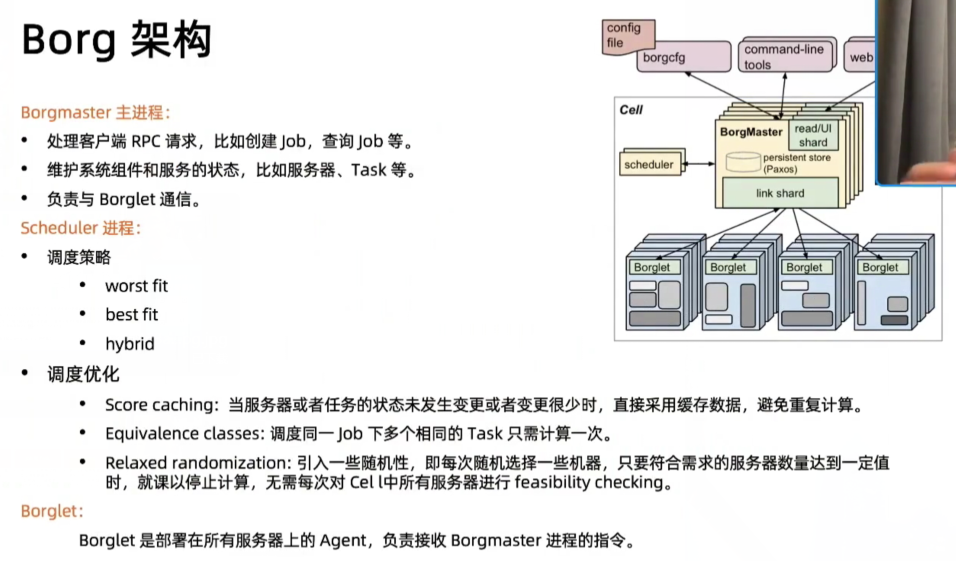

= borg

组成

. 控制面
. 数据面

可监测并重新分配声明后但未使用的资源

== 特性

. 物理资源利用率高；
. 服务器共享，在进程级别做隔离；
. 应用高可用，故障恢复时间短；
. 调度策略灵活；
. 应用接入和使用方便。提供了完备的Job描述语言，服务发现，实时状态监控和诊断工具。

== 优势

. 对外隐藏底层资源管理和调度、故障处理等；
. 实现应用的高可靠和高可用；
. ·足够弹性，支持应用跑在成千上万的机器上。

== 基本概念

. Workload
.. prod 在线任务，长期运行、对延时敏感、交应用部署请求。一个面向终端用户等，比如：Gmail, Google 服务等。
.. non-prod 离线任务也称为批处理任务（batch），比如一些分布式计算服务等。

. Cell
.. 一个Cell上跑一个集群管理系统 Borg。
.. 通过定义Cell 可以让Borg 对服务器资源进行统一抽象，作为用户就无需知道自己的应用跑在哪台机器上，也不用关心资源分配、程序安装、依赖管理、健康检查及故障恢复等。

. Job 和 Task
.. 用户以Job 的形式提交应用部署请求。一个 Job 包含一个或者多个相同的 Task，每个Task运行相同的一份应用程序，Task数量就是应用的副本数。
.. 每个Job可以定义一些属性、元信息和优先级，优先级涉及到抢占式调度过程。

. Naming
.. Borg的服务发现通过 BNS ( Borg name service）来实现。
.. 50.jfoo.ubar.cc.borg.google.com 可表示在一个名为 cc 的 Cell 中由用户uBar 部署的一个名为 jFoo 的 Job 下的第50个Task。

== 应用高可用

. 被抢占的 non-prod 任务放回 pending queue，等待重新调度；
. 多副本应用跨故障域部署。所谓故障域有大有小，比如相同机器、相同机架或相同电源插座挂全挂；
. 对于类似服务器或操作系统升级的维护操作，避免大量服务器同时进行；
. 支持幂等性，支持客户端重复操作；
. 当服务器状态变为不可用时，要控制重新调度任务的速率。因为 Borg 无法区分是节点故障还是出现了短暂的网络分区，如果是后者，静静地等待网络恢复更利于保障服务可用性；
. 当某种“任务服务器”的组合出现故障时，下次重新调度时需避免这种组合再次出现，因为极大可能会再次出现相同故障；
. 记录详细的内部信息，便于故障排查和分析；
. 保障应用高可用的关键性设计原则是:无论何种原因，即使Borgmaster或者Borglet 挂掉、失联，都不能杀掉正在运行的服务（Task) 。
