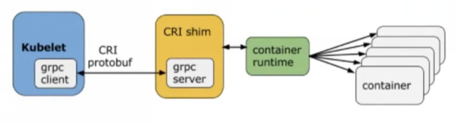
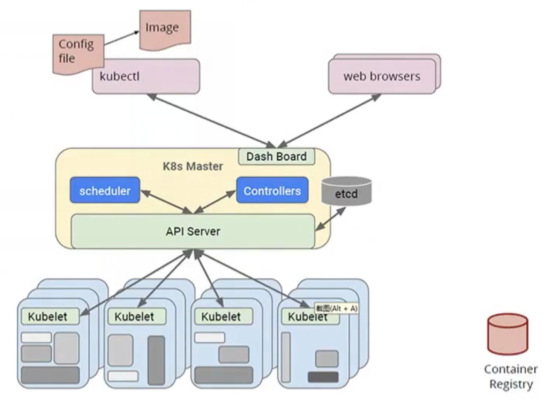

= kubernetes

Kubernetes是谷歌开源的容器集群管理系统，是Google多年大规模容器管理技术日开源版本，主要功能包括:

. 基于容器的应用部署、维护和滚动升级;
. 负载均衡和服务发现;
. 跨机器和跨地区的集群调度;
. 自动伸缩;
. 无状态服务和有状态服务;
. 插件机制保证扩展性。

Kubernetes 采用与 Borg 类似的架构

== 命令式( Imperative ) vs 声明式( Declarative)

命令式系统关注“如何做”（面向过程 ）

    在软件工程领域，声明式系统指程序代码描述系统应该做什么而不是怎么做。仅限于描述要达到什么目的，如何达到目的交给系统。

    我要你做什么，怎么做，请严格按照我说的

声明式系统关注“做什么”（面向对象，把一切抽象成对象）

    在软件工程领域，声明式系统是写出解决某个问题，完成某个任务，或者达到某个目标的的明确步骤。此方法明确写出系统应该执行某指令，并且期待系统返回期望结果。

    我需要你帮我做点事，但是我只告诉你我需要你做什么，不是你应该怎么做。
    直接声明︰我直接告诉你我需要什么。
    间接声明∶我不直接告诉你我的需求，我会把我的需求放在特定的地方，请在方便的时候拿出来处理。

幂等性

    状态固定，每次我我要你做事，请给我返回相同结果。
